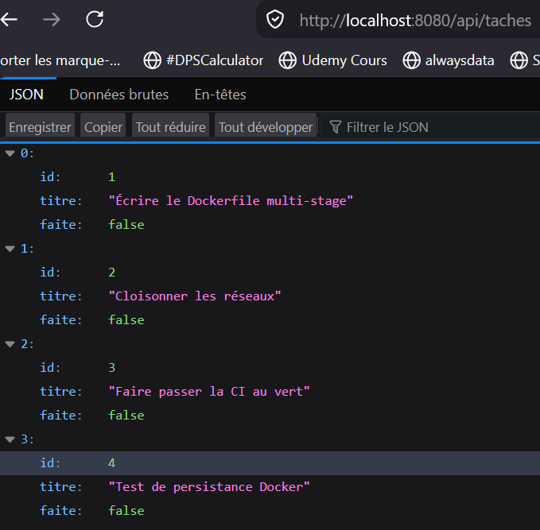
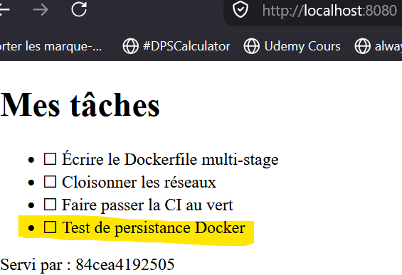
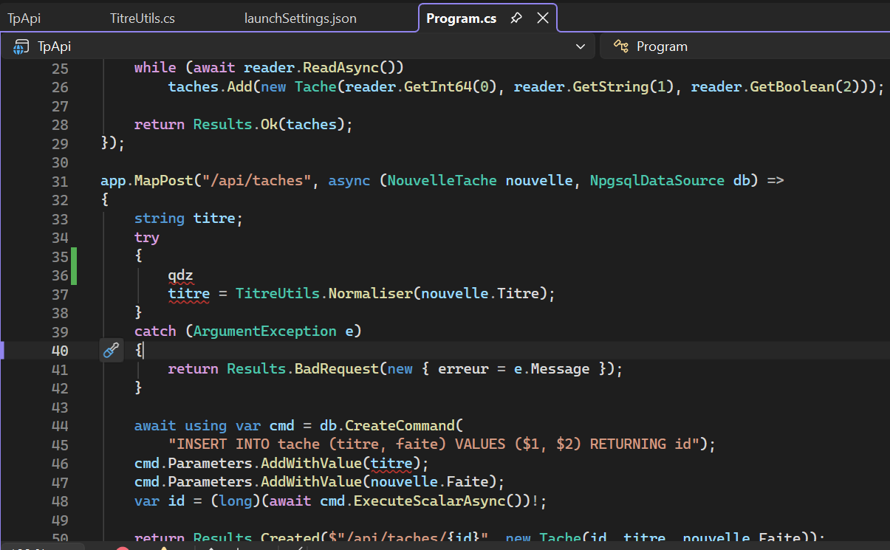
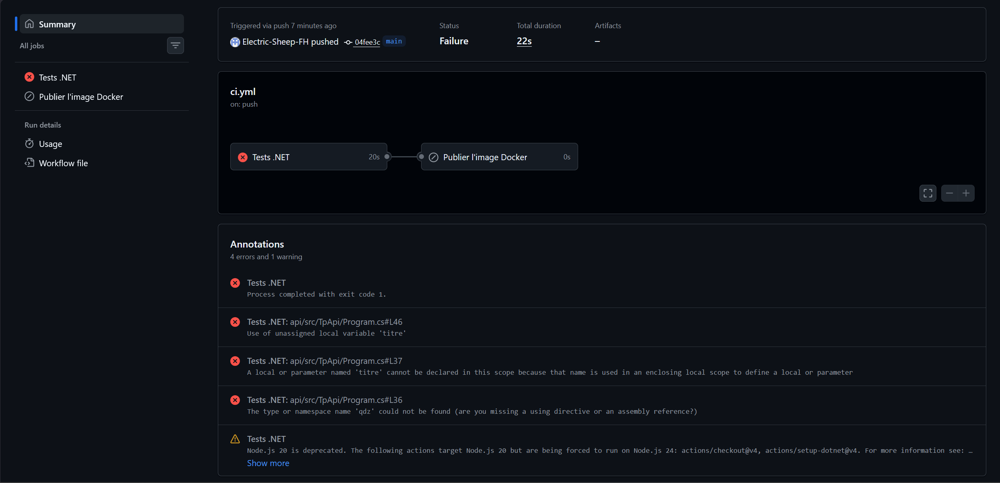
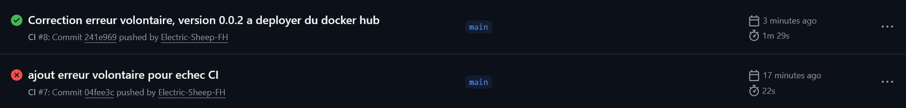
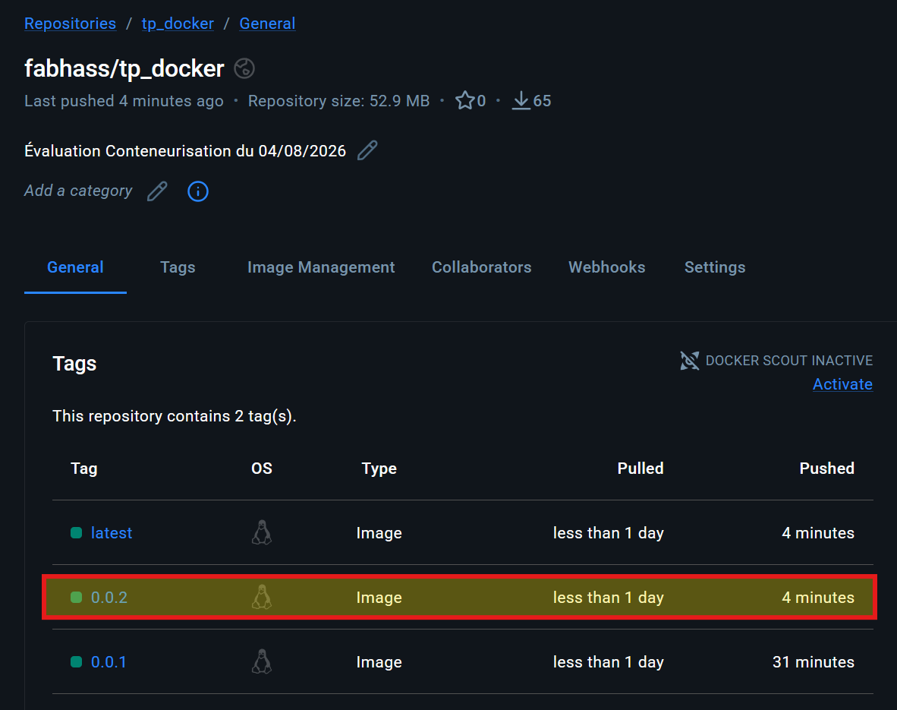

# Rapport - TP Docker & CI

## 1. Choix technique

Le parcours retenu est **C# / ASP.NET Core / .NET 10**.

## 2. Image API multi-stage

Le premier stage utilise le SDK .NET pour restaurer et publier l'application.
Le second stage repart du runtime ASP.NET Core uniquement et ne reçoit que `/app/publish`. Les images
de base sont verrouillées par digest. Le manifeste est copié avant les sources afin que la
couche `dotnet restore` reste en cache lorsque seul le code C# change.

Commandes à exécuter et sorties à coller :

```sh
docker image build -t tp-api:0.0.1 ./api
docker image ls tp-api
docker image inspect tp-api:0.0.1 --format '{{.Config.User}}'
docker container run --rm --entrypoint dotnet tp-api:0.0.1 --list-sdks
```

Résultats locaux :

```text
Utilisateur : 1654
Taille : 122 429 969 octets, soit environ 122 Mo (< 200 Mo)
dotnet --list-sdks : aucune sortie, donc aucun SDK dans l'image finale
```

Après modification d'un fichier `.cs`, relancer :

```sh
docker image build -t tp-api:0.0.1 ./api
```

Résultat observé :

```text
[build 5/7] RUN dotnet restore src/TpApi/TpApi.csproj --locked-mode
[build 5/7] CACHED
```

## 3. Docker Compose et persistance

L'application démarre avec quatre services et trois replicas de l'API :

```sh
docker compose up -d --build
docker compose ps
```

Créer une tâche, arrêter sans supprimer les volumes, redémarrer puis relire la liste :

```sh
curl -X POST http://localhost:8080/api/taches \
  -H 'Content-Type: application/json' \
  -d '{"titre":"Tâche persistante","faite":false}'
docker compose down
docker compose up -d
curl http://localhost:8080/api/taches
```

Résultat observé après `docker compose down` puis `docker compose up -d` :

```json
{"id":4,"titre":"Test de persistance Docker","faite":false}
```

La tâche d'identifiant 4 était toujours présente avec les trois tâches initiales.




## 4. Reverse proxy, load-balancing et limitation de débit

nginx répartit les requêtes avec `least_conn`. Il limite `/api` à 10 requêtes par seconde
et par IP, avec un burst de 20, et transmet l'adresse réelle du client.

```sh
for i in $(seq 1 12); do curl -s http://localhost:8080/api/qui; echo; done
for i in $(seq 1 60); do curl -s -o /dev/null -w "%{http_code} " \
  http://localhost:8080/api/taches; done
```

Les trois hostnames ont été servis successivement :

```text
33067d8c9a1a
5f4be35f5209
7348ea9664b1
```

La rafale de 60 requêtes contenait des réponses limitées :

```text
200 200 200 200 200 200 200 200 200 200 200 200 200 200 200 200
200 200 200 200 200 200 200 200 200 200 200 200 503 503 503 503
200 503 503 503 503 503 200 503 503 503 503 503 503 200 503 503
503 503 503 200 503 503 503 503 503 200 503 503
```

## 5. Intégration continue

Le job `test` s'exécute sur les pull requests et les pushes vers `main`. Le job `docker`
dépend des tests, ne s'exécute que pour un push sur `main`, extrait la version du `.csproj`
et publie les tags de version et `latest`.

> Test d'erreur dans le code afin de vérifier que l'image n'est pas push vers docker hub

Saisie d'une erreur dans `Program.cs` :



Je push ensuite le code en erreur. Je peux alors constater sur github Actions que le job "tests.net" est en erreur, le job "Publier l'image Docker" n'a donc pas eu lieu :



Il n'y a donc pas eu de push de l'image vers Docker Hub.

> Je corrige l'erreur du fichier `program.cs`, je met la version en "0.0.2" dans le csproj, puis je push :

Suite au push, je constate la réussite grâce à la coche verte : 



Je peux alors confirmer grâce à Docker Hub, et constate bien la création d'une image en version 0.0.2 :




URL de l'image Docker Hub : `https://hub.docker.com/repository/docker/fabhass/tp_docker/general`

## 6. Cloisonnement réseau

### Le service web ne peut pas joindre la base

```sh
docker compose exec web sh -c \
  "getent hosts db || echo 'db inaccessible depuis web : OK'"
```

Sortie observée :

```text
db inaccessible depuis web : OK
```

### L'API peut joindre la base

L'image API ne contient volontairement aucun client PostgreSQL. La résolution DNS et
l'ouverture TCP peuvent être testées avec BusyBox :

```sh
docker compose exec api sh -c \
  "getent hosts db && nc -zvw3 db 5432 && echo 'db joignable depuis api : OK'"
```

Sortie observée :

```text
172.21.0.2        db  db
db (172.21.0.2:5432) open
db joignable depuis api : OK
```

### PostgreSQL n'est pas publié sur l'hôte

```sh
docker compose ps db
docker inspect $(docker compose ps -q db) \
  --format '{{json .HostConfig.PortBindings}}'
```

Sortie observée :

```text
PORTS : 5432/tcp
PortBindings : {}
```

`5432/tcp` est seulement exposé dans le réseau Docker. L'objet de publication de ports
est vide, donc aucune correspondance vers un port de la machine hôte n'existe.
