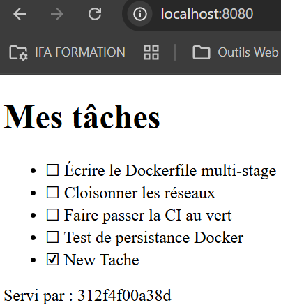

# TP Docker & CI - C# / ASP.NET Core

Technologie choisie : **C# avec ASP.NET Core sur .NET 10**.

Ce dépôt contient une petite API de tâches, un front statique, un reverse proxy nginx et
une base PostgreSQL.

Les résultats demandés de l'exercice sont détaillés dans le fichier `RAPPORT.md`, disponible à la même racine.

## Démarrage

Mon fichier `.env` local reste ignoré par Git. Pour recréer sa propre configuration, on peut alors utiliser le fichier `.env.example` fourni :

```sh
cp .env.example .env
```

Lancer toute l'application :

```sh
docker compose up -d --build
```

Puis ouvrir <http://localhost:8080>. 

Pour arrêter les conteneurs sans supprimer les
données :

```sh
docker compose down
```

## Architecture

- `proxy` est le seul service publié sur l'hôte (`8080:80`).
- `web` partage uniquement le réseau `proxy-front` avec le proxy.
- les trois replicas `api` partagent `proxy-back` avec le proxy et `backend` avec la base.
- `db` partage uniquement `backend` avec l'API et conserve ses données dans un volume nommé.

Le service web ne peut donc pas résoudre ni joindre la base, et PostgreSQL ne publie aucun
port sur l'hôte.

## API

```text
GET  /api/taches
POST /api/taches    {"titre":"Ma tâche","faite":false}
GET  /api/qui
GET  /health        (interne à l'API)
```

Exemple de création :

```sh
curl -X POST http://localhost:8080/api/taches \
  -H "Content-Type: application/json" \
  -d '{"titre":"New Tache","faite":true}'
```



## Tests locaux

```sh
dotnet test api/tests/TpApi.Tests/TpApi.Tests.csproj
docker compose config --quiet
```

Les commandes de vérification Docker et réseau à reporter sont détaillées dans
`RAPPORT.md`.

## Configuration GitHub et Docker Hub

Créer le dépôt public, puis définir dans GitHub :

- la variable `DOCKERHUB_USERNAME` avec le login Docker Hub ;
- le secret `DOCKERHUB_TOKEN` avec un jeton d'accès Docker Hub.

Sur une pull request vers `main`, seuls les tests s'exécutent. Après un push ou un merge
sur `main`, la CI publie `docker.io/<login>/tp_docker` avec les tags `0.0.1` (les numéros de version sont à changer dans le fichier `TpApi.csproj`) et `latest`.
